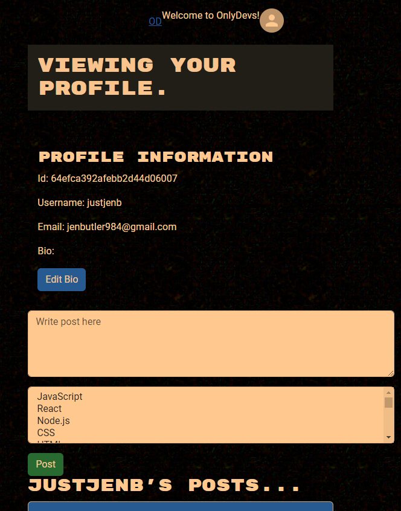
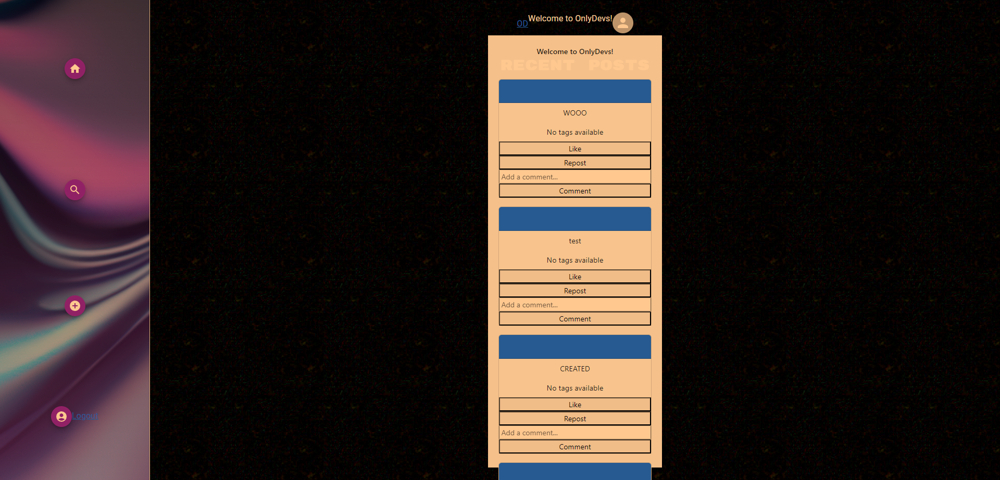

# onlyDEVS

  

  > ## DESCRIPTION
A social media app for the web development community. We wanted to provide a place for developers to connect and share content.

## TABLE OF CONTENTS
  1. [Description](#description)
  2. [Usage](#usage)
  3. [Contributing](#contributing)
  4. [Credits](#credits)
  5. [Tech](#tech)
  6. [License](#license)
  7. [References](#references)
  8. [Questions](#questions)

> ## USAGE
#### Go to our website [OnlyDevs](https://onlydevs-504c5476d7ee.herokuapp.com/)

#### You can view posts when not logged in 
#### Create an account or log in using your GitHub or Google account  

#### Click your profile to create a post 

#### View posts  
#### Click the search icon to seach by coding language tags 

> ## CONTRIBUTING
#### If you are interested in contributing to this project, please follow these steps:
- Fork the repo on GitHub
- Clone the project to your own machine
- Commit changes to your own branch
- Push your work back up to your fork
- Submit a pull request for review

> ## CREDITS
#### [Aidan Farina](https://github.com/Aidan-Farina)
#### [Jen Butler](https://github.com/justjenb)
#### [Kat Gorecki](https://github.com/SLAYsian)
#### [Michael Prevost](https://github.com/m00krat)

> ## TECH
&nbsp;
&nbsp;
&nbsp;
&nbsp;
&nbsp;
&nbsp;
&nbsp;
&nbsp;
- Apollo
- GraphQL
- Vite
- Mongoose
- Passport
- JWT

> ## LICENSE
 
Please see the LICENSE file for details

> ## REFERENCES
- UConn Full Stack Bootcamp

> ## QUESTIONS
For any questions, please reach out to the contributors, [Aidan Farina](https://github.com/Aidan-Farina) |
[Jen Butler](https://github.com/justjenb) | [Kat Gorecki](https://github.com/SLAYsian) | [Michael Prevost](https://github.com/m00krat), via GitHub., via GitHub.

